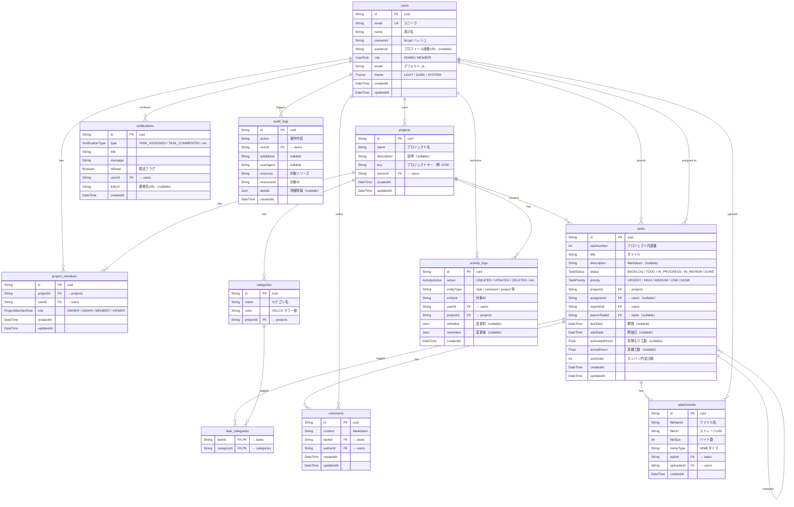

# ER図（Entity Relationship Diagram）

Prisma スキーマ（`prisma/schema.prisma`）に基づく全 11 テーブルの ER 図。

## テーブル一覧

| # | テーブル名 | 説明 |
|---|-----------|------|
| 1 | users | ユーザー（認証・プロフィール） |
| 2 | projects | プロジェクト |
| 3 | project_members | プロジェクトメンバー（多対多の中間テーブル） |
| 4 | tasks | タスク |
| 5 | categories | カテゴリ / ラベル |
| 6 | task_categories | タスク×カテゴリ（多対多の中間テーブル） |
| 7 | comments | コメント |
| 8 | attachments | ファイル添付 |
| 9 | activity_logs | アクティビティログ |
| 10 | notifications | 通知 |
| 11 | audit_logs | 監査ログ |

## リレーション概要

- **users ↔ projects**: 1:N（オーナー）
- **users ↔ projects**: N:N（project_members 経由）
- **projects → tasks**: 1:N
- **users → tasks**: 1:N（reporter / assignee）
- **tasks → tasks**: 自己参照 1:N（サブタスク）
- **tasks ↔ categories**: N:N（task_categories 経由）
- **tasks → comments**: 1:N
- **tasks → attachments**: 1:N
- **users / projects → activity_logs**: 1:N
- **users → notifications**: 1:N
- **users → audit_logs**: 1:N
