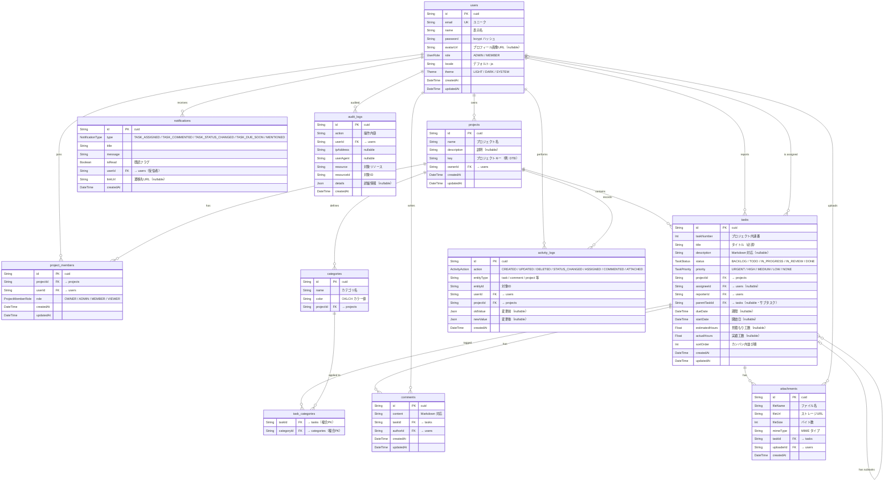

# ER図（Entity Relationship Diagram）

```mermaid
erDiagram
    users {
        String id PK "cuid"
        String email UK "ユニーク"
        String name "表示名"
        String password "bcrypt ハッシュ"
        String avatarUrl "プロフィール画像URL（nullable）"
        UserRole role "ADMIN / MEMBER"
        String locale "デフォルト: ja"
        Theme theme "LIGHT / DARK / SYSTEM"
        DateTime createdAt
        DateTime updatedAt
    }

    projects {
        String id PK "cuid"
        String name "プロジェクト名"
        String description "説明（nullable）"
        String key "プロジェクトキー（例: DTB）"
        String ownerId FK "→ users"
        DateTime createdAt
        DateTime updatedAt
    }

    project_members {
        String id PK "cuid"
        String projectId FK "→ projects"
        String userId FK "→ users"
        ProjectMemberRole role "OWNER / ADMIN / MEMBER / VIEWER"
        DateTime createdAt
        DateTime updatedAt
    }

    tasks {
        String id PK "cuid"
        Int taskNumber "プロジェクト内連番"
        String title "タイトル（必須）"
        String description "Markdown 対応（nullable）"
        TaskStatus status "BACKLOG / TODO / IN_PROGRESS / IN_REVIEW / DONE"
        TaskPriority priority "URGENT / HIGH / MEDIUM / LOW / NONE"
        String projectId FK "→ projects"
        String assigneeId FK "→ users（nullable）"
        String reporterId FK "→ users"
        String parentTaskId FK "→ tasks（nullable・サブタスク）"
        DateTime dueDate "期限（nullable）"
        DateTime startDate "開始日（nullable）"
        Float estimatedHours "見積もり工数（nullable）"
        Float actualHours "実績工数（nullable）"
        Int sortOrder "カンバン内並び順"
        DateTime createdAt
        DateTime updatedAt
    }

    categories {
        String id PK "cuid"
        String name "カテゴリ名"
        String color "OKLCH カラー値"
        String projectId FK "→ projects"
    }

    task_categories {
        String taskId FK "→ tasks（複合PK）"
        String categoryId FK "→ categories（複合PK）"
    }

    comments {
        String id PK "cuid"
        String content "Markdown 対応"
        String taskId FK "→ tasks"
        String authorId FK "→ users"
        DateTime createdAt
        DateTime updatedAt
    }

    attachments {
        String id PK "cuid"
        String fileName "ファイル名"
        String fileUrl "ストレージURL"
        Int fileSize "バイト数"
        String mimeType "MIME タイプ"
        String taskId FK "→ tasks"
        String uploaderId FK "→ users"
        DateTime createdAt
    }

    activity_logs {
        String id PK "cuid"
        ActivityAction action "CREATED / UPDATED / DELETED / STATUS_CHANGED / ASSIGNED / COMMENTED / ATTACHED"
        String entityType "task / comment / project 等"
        String entityId "対象ID"
        String userId FK "→ users"
        String projectId FK "→ projects"
        Json oldValue "変更前（nullable）"
        Json newValue "変更後（nullable）"
        DateTime createdAt
    }

    notifications {
        String id PK "cuid"
        NotificationType type "TASK_ASSIGNED / TASK_COMMENTED / TASK_STATUS_CHANGED / TASK_DUE_SOON / MENTIONED"
        String title
        String message
        Boolean isRead "既読フラグ"
        String userId FK "→ users（受信者）"
        String linkUrl "遷移先URL（nullable）"
        DateTime createdAt
    }

    audit_logs {
        String id PK "cuid"
        String action "操作内容"
        String userId FK "→ users"
        String ipAddress "nullable"
        String userAgent "nullable"
        String resource "対象リソース"
        String resourceId "対象ID"
        Json details "詳細情報（nullable）"
        DateTime createdAt
    }

    %% === リレーション ===

    %% users → projects（オーナー）
    users ||--o{ projects : "owns"

    %% users ↔ projects（多対多: project_members 経由）
    users ||--o{ project_members : "joins"
    projects ||--o{ project_members : "has"

    %% projects → tasks
    projects ||--o{ tasks : "contains"

    %% users → tasks（起票者）
    users ||--o{ tasks : "reports"

    %% users → tasks（担当者・nullable）
    users |o--o{ tasks : "is assigned"

    %% tasks → tasks（サブタスク・自己参照）
    tasks |o--o{ tasks : "has subtasks"

    %% tasks ↔ categories（多対多: task_categories 経由）
    tasks ||--o{ task_categories : "tagged"
    categories ||--o{ task_categories : "applied to"

    %% projects → categories
    projects ||--o{ categories : "defines"

    %% tasks → comments
    tasks ||--o{ comments : "has"

    %% users → comments
    users ||--o{ comments : "writes"

    %% tasks → attachments
    tasks ||--o{ attachments : "has"

    %% users → attachments
    users ||--o{ attachments : "uploads"

    %% users → activity_logs
    users ||--o{ activity_logs : "performs"

    %% projects → activity_logs
    projects ||--o{ activity_logs : "records"

    %% users → notifications
    users ||--o{ notifications : "receives"

    %% users → audit_logs
    users ||--o{ audit_logs : "audited"
```
